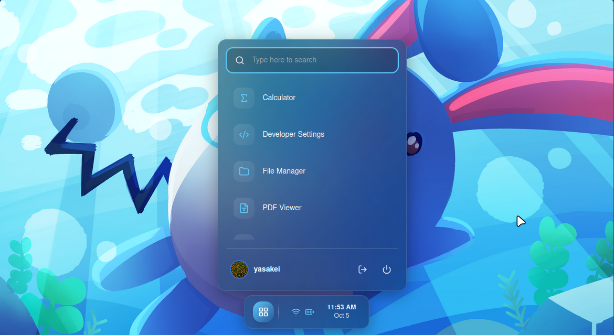
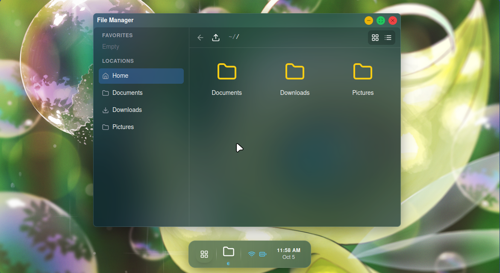
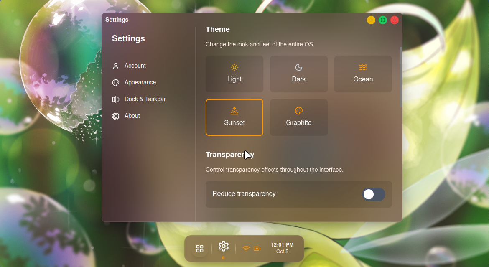

# XOS (Unfinished) - Deployment Guide
>[!IMPORTANT]
> Orginial author not actively working on this project as of now. If you are interested to Contribute, Follow the guidelines.

>[!WARNING]
> The codes aren't welly optimized, please be cautious while proceeding 

## Prerequisites
- Node.js (v18 or higher)
- pnpm (v8 or higher)
- Docker (optional, for containerized deployment)

## Development

To run the development environment:

# XOS - Web Operating System Environment

A modern, React-based web operating system environment that provides a desktop-like experience in your browser with virtual file system, applications, and productivity tools.

## 🚀 Features

- **Virtual Desktop Environment**: Full desktop experience in the browser
- **Virtual File System (VFS)**: Persistent file storage and management
- **Multiple Applications**: Integrated apps like file manager, text editor, terminal, etc.
- **Responsive Design**: Works on all device sizes
- **Modern UI/UX**: Clean and intuitive user interface

## 📷 Screenshots

<div align="center">
  

*Main desktop view of XOS*


*Virtual File System with file management capabilities*


*Settings Application*

</div>

## 🛠️ Prerequisites

- Node.js (v18 or higher)
- pnpm (v10 or higher)
- Git

## 📦 Installation and Setup

1. **Clone the repository**
   ```bash
   git clone https://github.com/yasakei/xos.git
   cd xos
   ```

2. **Install dependencies**
   ```bash
   pnpm install
   ```

3. **Run in development mode**
   ```bash
   pnpm dev
   ```
   This will start both the backend server and frontend development server.

4. **Access the application**
   - Frontend: [http://localhost:5173](http://localhost:5173)
   - Backend API: [http://localhost:3001](http://localhost:3001)

## 🚀 Production Build

To build the application for production:

```bash
pnpm build
```

To run the production build:

```bash
sh run-prod.sh
```

The application will be available at:
- Frontend: [http://localhost:8080](http://localhost:8080)
- Backend: [http://localhost:3001](http://localhost:3001)

## 🏗️ Project Structure

```
XOS/
├── packages/
│   ├── backend/          # Backend server with API and VFS
│   ├── frontend/         # React frontend application
│   ├── shared/           # Shared types and utilities
│   └── proxy/            # API proxy for development
├── docker-compose.yml    # Docker configuration
├── Dockerfile            # Production Dockerfile
├── run-dev.sh           # Development startup script
└── run-prod.sh          # Production startup script
```

## 🔧 Available Scripts

- `pnpm dev`: Start development servers for both frontend and backend
- `pnpm build`: Build both frontend and backend for production
- `sh run-dev.sh`: Alternative development startup
- `sh run-prod.sh`: Production startup script

## 🤝 Contributing

1. Fork the repository
2. Create a feature branch (`git checkout -b feature/amazing-feature`)
3. Make your changes
4. Commit your changes (`git commit -m 'Add some amazing feature'`)
5. Push to the branch (`git push origin feature/amazing-feature`)
6. Open a Pull Request

## ⚖️ License

This project is licensed under the GNU General Public License v3.0 or later (GPL-3.0-or-later) - see the [LICENSE](LICENSE) file for details.

Copyright (C) 2025 yasakei

## 🐛 Issues and Support

If you encounter any issues or have questions, please [file an issue](https://github.com/yasakei/XOS_React/issues) on GitHub.

## 🙏 Acknowledgments

- Built with React and modern web technologies
- Inspired by desktop environments and operating systems
- Thanks to the open-source community for the amazing tools and libraries

This will start both the frontend (on port 5173) and backend (on port 3001) in development mode.

## Production Deployment

### Method 1: Direct Deployment

1. Build the application:
```bash
pnpm build
```

2. Start the application:
```bash
./run-prod.sh
```

This will start both the frontend (on port 8080) and backend (on port 3001) in production mode.

### Method 2: Docker Deployment

1. Build and run with Docker:
```bash
docker-compose up -d
```

This will start both services in detached mode.

2. To stop the services:
```bash
docker-compose down
```

### Method 3: PM2 Deployment

1. Install PM2 globally:
```bash
npm install -g pm2
```

2. Start the application with PM2:
```bash
pm2 start ecosystem.config.json
```

3. Save the PM2 configuration:
```bash
pm2 save
```

## Environment Variables

The application supports the following environment variables:

- `NODE_ENV`: Set to "production" for production deployments
- `PORT`: Port for the frontend service (default: 8080)
- Backend uses port 3001 by default

## Health Checks

Both services include health check endpoints:

- Backend: `http://localhost:3001/api/health`
- Frontend: `http://localhost:8080/` (will return 200 for any valid request)

## Data Persistence

User data is stored in the VFS (Virtual File System). In Docker deployments, this data is persisted in a Docker volume.